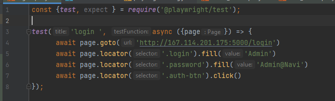
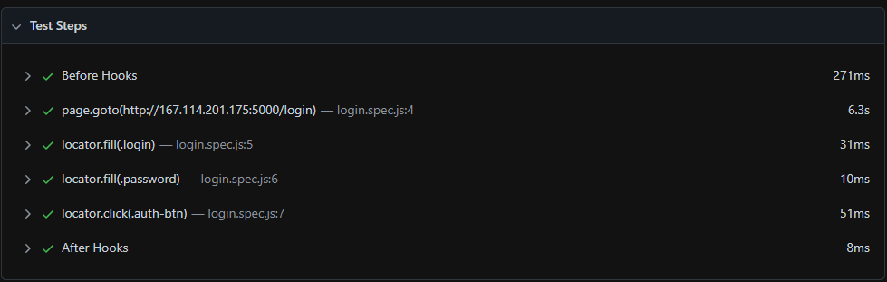
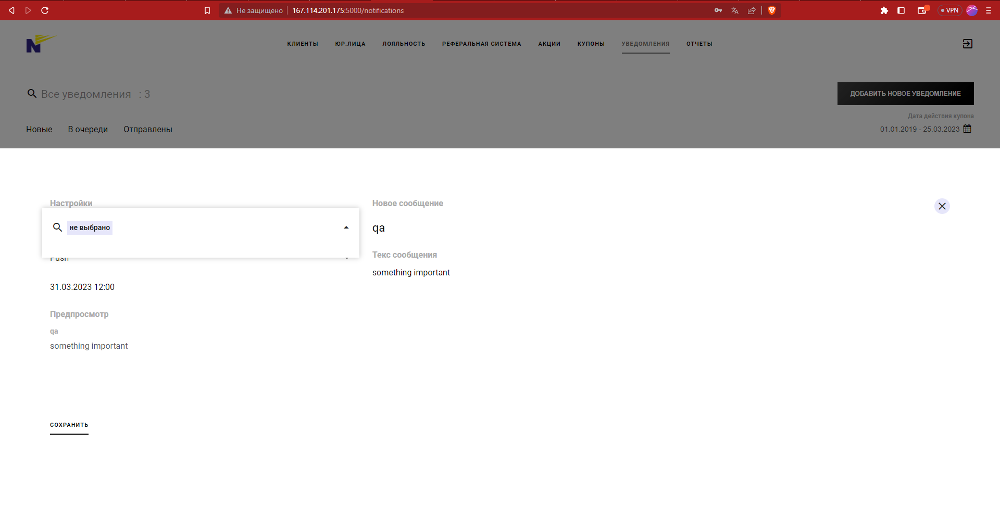

# autotest_qa_mid
    I'm using the playwright library for a testing

    command to run - npx playwright test <name of file>
    file name - login.spec.js

        Example:
    npx playwright test create_new_notification.spec.js

    LOGS

    for familiarization, please watch this video ->https://youtu.be/mLKXEEpuO00

    if you want to try this library you can follow this link https://playwright.dev/docs/intro

---
    item (user group) there are no options to choose from

    problem is fixed